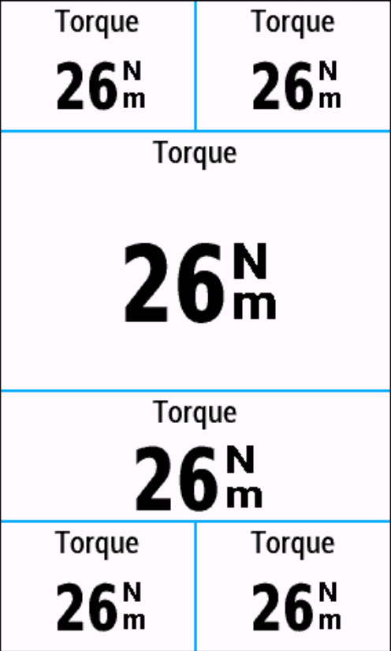
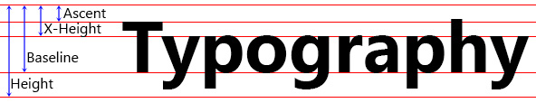

# Torque Data Field for the Garmin 1030Plus
### Introduction
This IQ data field displays the torque value on your Garmin 1030Plus. All data field sizes are supported. Of course you need a power meter installed.

By default the data field displays the average of the last 3 values to get a more stable display. You can change this number via your mobile phone or in Garmin Express.

### Languages
The torque data field supports English, German, French and Spanish.

## Implementation Details
### Font Metric

The Garmin API delivers some very rudimentary font metric data. They turned out not to be correct for all fonts and to be incomplete. In order to position text correcly the data must be pixel perfect and more data are needed. The data of each font were determined experimentally on an Garmin 1030Plus device. That's why the data field is bound to that device.

### Garmin Unit Font Emulation
Garmin unfortunately doesn't expose the fonts they use for the units in the API. Special care has been taken to simulate the unit fonts as good as possible. The characters were manually edited to match the Garmin fonts. 
