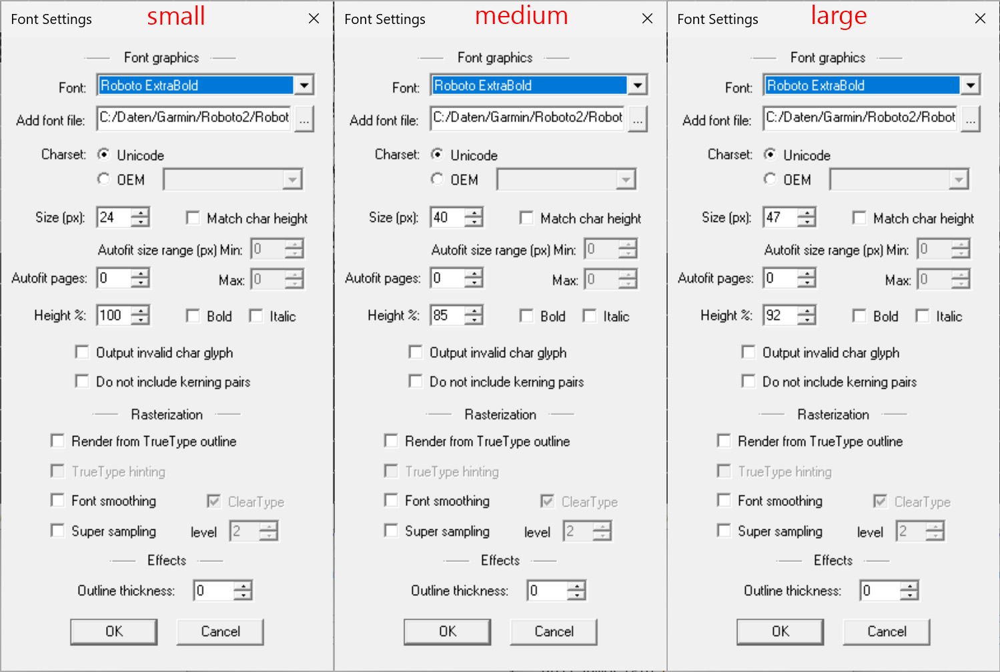

# Torque Data Field for the Garmin 1030Plus
### Introduction
This IQ data field displays the torque value on your Garmin 1030Plus. All data field sizes are supported. Of course you need a power meter installed.

By default the data field displays the average of the last 3 values to get a more stable display. You can change this number via you mobile phone or in Garmin Express.

### Languages
The torque data field supports English, German, French and Spanish.

## Implementation Details
### Font Metric

The Garmin API delivers some very rudimentary font metric data. Useful are the Height and Descent values. In order to measure and position text correcly more data about the font are needed. The missing values X-Height and Ascent for each font were determined experimentally on an Garmin 1030Plus device. That's why the data field is bound to that device.

### Garmin Unit Font Emulation
Garmin unfortunately doesn't expose the fonts they use for the units in the API. Special care has been taken to simulate the unit fonts as good as possible. It turned out that Roboto from Google is the perfect starting point. You need to use the BMFont tool anyhow to convert the font into a bitmap font. Some experiments have shown that the emulation is almost perfect with the following settings.

The settings are also available in the Roboto directory as configuration files for the BMFont tool.

